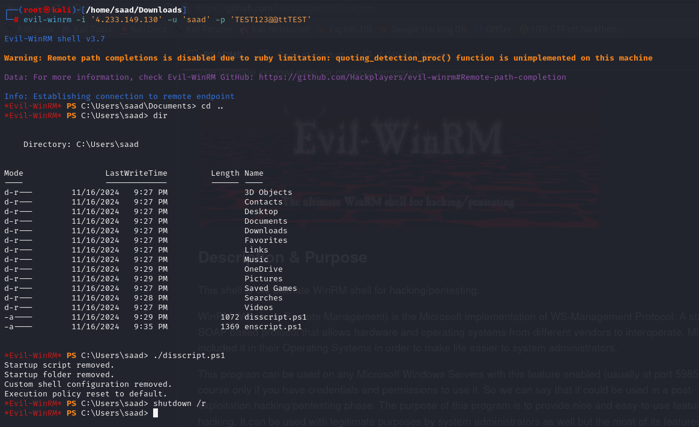

# Intranet Kiosk Mode Controller Tool


This project provides PowerShell scripts for remote Windows management via Evil-WinRM, enabling/disabling system modes through PowerShell Remoting.

## Table of Contents

 - [Features]()
 - [Installation]()
 
 - [License]()


## Features

- **Dual-Mode Control**: Switch between kiosk and normal modes with dedicated enable/disable scripts
- **Remote Management Ready**: Designed for Evil-WinRM and PSRemoting access (ports 5985/5986)
- **Automatic Kiosk Configuration**: Forces Edge browser to launch in full-screen kiosk mode with specified URL
- **Self-Cleaning Mechanism**: Disable script completely removes all artifacts and reverts changes
- **System Integration**: Modifies registry, execution policies, and creates persistent startup scripts
- **Emergency Recovery**: Allows remote system restoration via PowerShell remoting
- **Verbose Output**: Provides clear status messages at each execution step
- **Enterprise Ready**: Suitable for digital signage, lab computers, and public terminals


## Installation

### Prerequisites

- Windows 10/11 system
- PowerShell 5.1+
- Administrative privileges
- Microsoft Edge installed (for kiosk mode)
- For remote access:
  - WinRM enabled (`Enable-PSRemoting -Force`)
  - Ports 5985 (HTTP) or 5986 (HTTPS) open
### Download

Clone or download the scripts on remote machine:
```powershell
   git clone https://github.com/SDX442/WinSecScripts.git
   cd WinSecScript
```  
### Usage
- Edit the configuration variables in enscript.ps1 :
```bash
$intranetUrl = "https://your-intranet-url.com"
``` 
- Remote Management via Evil-WinRM  
```bash
evil-winrm -i [TARGET_IP] -u [USERNAME] -p [PASSWORD]

[Evil-WinRM]> ./enscript.ps1
[Evil-WinRM]> shutdown /r
```

## License


This project is licensed under the MIT License- See [LICENSE](https://choosealicense.com/licenses/mit/) for details.
## 


